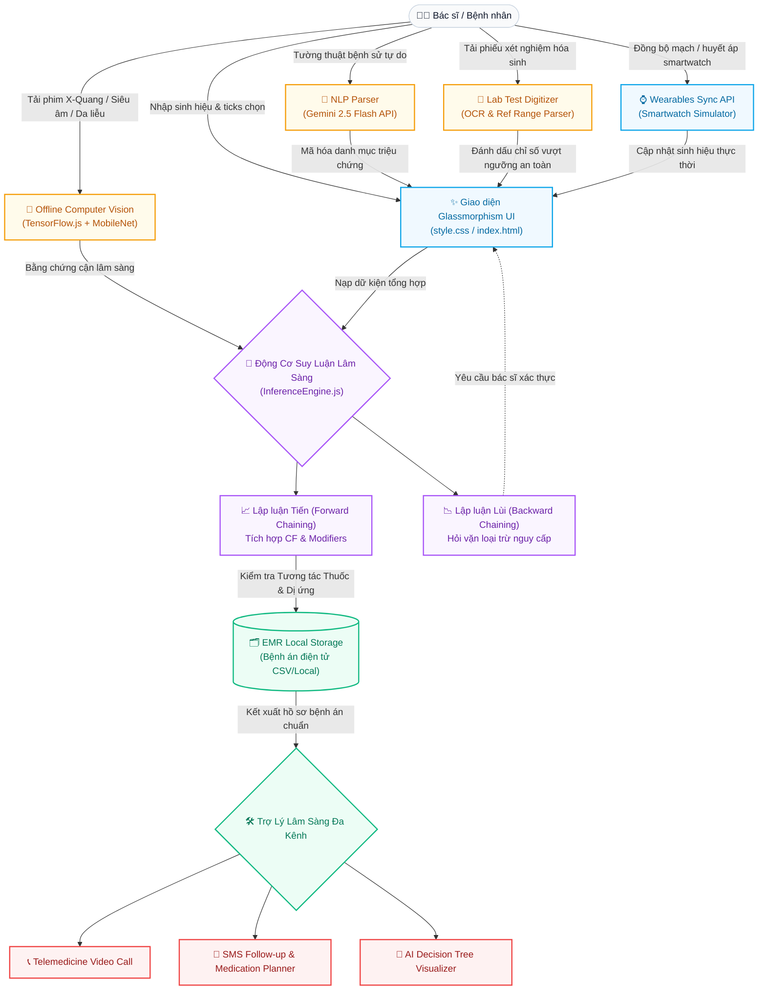

# <p align="center">🩺 HỆ THỐNG CHẨN ĐOÁN Y KHOA AI</p>
### <p align="center">**Advanced Hybrid Clinical Expert System & Generative AI Edge Platform**</p>

<p align="center">
  
</p>

<p align="center">
  <a href="https://github.com/DaTaiGroup/DuAnYKhoa">
    
  </a>
  
  
  
  
  
</p>

---

## 💎 Tổng Quan Dự Án (Executive Summary)

**Hệ Thống Chẩn Đoán Y Khoa AI** là một giải pháp y tế số đột phá được nghiên cứu và phát triển bởi **nhóm DaTai**. Hệ thống tích hợp một cách tinh tế hai luồng tư duy công nghệ mạnh mẽ nhất hiện nay: **Động cơ suy luận lập luận lâm sàng cổ điển (Classic Symbolic Reasoning)** và **Mạng nơ-ron học sâu thế hệ mới (Deep Generative AI & Edge Neural Network)**. 

Bằng cách loại bỏ hoàn toàn các cấu trúc back-end cồng kềnh, toàn bộ quá trình tính toán hình ảnh, trích xuất dữ liệu xét nghiệm và xử lý ngôn ngữ tự nhiên được thực thi **trực tiếp 100% tại trình duyệt máy khách (Client-side Edge Computing)**. Phương thức này mang đến tốc độ phản hồi tức thời, khả năng vận hành offline linh hoạt và bảo mật tối đa dữ liệu bệnh án nhạy cảm của bệnh nhân theo các tiêu chuẩn y tế nghiêm ngặt.

---

## ⚙️ Kiến Trúc Luồng Nghiệp Vụ (System Architecture Flow)

Sự phối hợp nhịp nhàng giữa các phân hệ được thiết kế trực quan hóa qua sơ đồ tương tác đa chiều dưới đây:



---

## 🌟 Các Phân Hệ Tính Năng Đột Phá (Key Breakthrough Features)

### 🩺 1. Động Cơ Lập Luận Lâm Sàng Kép (Hybrid Inference Engine)
Hệ thống sử dụng bộ óc phán đoán đa chiều tích hợp trong tệp [inferenceEngine.js](file:///d:/MyProjects/DuAnYKhoa/inferenceEngine.js):
- **Lập luận Tiến (Forward Chaining)**: Rà soát hơn 100+ thuộc tính bệnh lý từ [knowledgeBase.js](file:///d:/MyProjects/DuAnYKhoa/knowledgeBase.js). Đối chiếu triệu chứng lâm sàng kết hợp với các **Yếu tố sửa đổi (Demographic Modifiers)** như giới tính, nhóm tuổi (nhi khoa, thành niên, lão khoa) và tiền sử bệnh nền để đưa ra hệ điểm tích lũy.
- **Lập luận Lùi (Backward Chaining) & Hỏi Vặn Sinh Mạng**: Bất cứ khi nào hệ thống phát hiện chẩn đoán sơ bộ trùng khớp với **8 nhóm bệnh lý khẩn cấp tối cấp** (*Nhồi máu cơ tim, Đột quỵ, Cơn tăng huyết áp cấp, Suy thận cấp...*), hệ chuyên gia sẽ lập tức quay ngược tiến trình để tìm kiếm các triệu chứng còn thiếu của bệnh đó. Giao diện sẽ hiển thị Modal cảnh báo màu đỏ sinh động và hỏi vặn bác sĩ để thu thập bằng chứng đầy đủ trước khi đưa ra kết luận cuối cùng.

### 📸 2. Trí Tuệ Nhân Tạo Rìa Offline (Edge AI Computer Vision)
Tích hợp trực tiếp thư viện **TensorFlow.js** (`@tensorflow/tfjs`) kết hợp mô hình phân loại hình ảnh học sâu **MobileNet**:
- **Không truyền dữ liệu**: Hình ảnh phim X-Quang phổi, sang thương da hoặc siêu âm khối u được tải và dự đoán hoàn toàn cục bộ trên GPU/CPU của máy người dùng thông qua mô hình CNN.
- **Lưới Quét Haptic (Scanner Laser Animation)**: Giao diện Glassmorphism mô phỏng luồng quét laser chuyển động quét ảnh nhịp nhàng, mang lại trải nghiệm y tế trực quan cực kỳ cao cấp và hiện đại.

### 📄 3. Bộ Số Hóa & Biện Giải Chỉ Số Hóa Sinh (Lab Test Digitizer)
- Tải tệp PDF hoặc ảnh chụp Phiếu xét nghiệm hóa sinh (máu, nước tiểu).
- AI giả lập OCR bóc tách số liệu tự động, đối chiếu với ngưỡng tham chiếu sinh lý chuẩn y khoa và lập bảng kết quả trực quan (đánh dấu đỏ các chỉ số nguy hiểm như Glucose tăng cao, độ thanh thải Creatinine suy giảm).
- Trợ lý AI tự động xuất bản khuyến nghị chăm sóc và phác đồ chuyên khoa tương thích.

### 🤖 4. Trợ Lý Bác Sĩ AI Không Gian Ngữ Cảnh (Gemini 2.5 Flash API)
- **Speech-to-Symptom**: Tận dụng API nhận dạng giọng nói **Web Speech API** để thu âm lời thoại tiếng Việt tự nhiên của bệnh nhân. Trợ lý AI sau đó sử dụng khả năng phân tích ngôn ngữ tự nhiên (NLP) của Gemini 2.5 Flash để bóc tách thực thể lâm sàng và tự động điền thông số triệu chứng vào Dashboard.
- **Contextual Chatbot Widget**: Một chatbot nổi bóng bẩy hỗ trợ hội chẩn trực tiếp. Bác sĩ AI nắm vững toàn bộ hồ sơ hiện thời của bệnh nhân để phản hồi các thắc mắc chuyên sâu về tương tác dược lý học, liều dùng và giải pháp dự phòng biến chứng.

### 🗂️ 5. Quản Lý Hồ Sơ Trạm EMR & Kiểm Tra Dược Lý Lâm Sàng
- **Cảnh báo Tương tác Thuốc tối cấp**: Hệ thống tự động đối chiếu đơn thuốc cũ, dị ứng nền của bệnh nhân với chẩn đoán bệnh lý mới để phát hiện nguy cơ sốc phản vệ hoặc chống chỉ định (ví dụ: *Nghiêm cấm dùng Aspirin/NSAID khi bệnh nhân có bệnh nền đau dạ dày cấp vì có nguy cơ gây xuất huyết tiêu hóa ồ ạt*).
- **Lưu trữ & Xuất CSV**: Cơ sở dữ liệu EMR lưu trữ cục bộ, hỗ trợ quản lý hồ sơ theo Mã Bệnh Nhân (PID) thế hệ mới và hỗ trợ kết xuất tệp CSV báo cáo nhanh chóng chỉ với 1 click.

---

## 🛠️ Công Nghệ Phát Triển & Thư Viện Tích Hợp (Premium Tech Stack)

| Công Nghệ | Phân Hệ | Vai Trò & Điểm Nhấn Thiết Kế |
| :--- | :--- | :--- |
| **Vanilla HTML5 & ES6+** | Core System | Thiết kế hướng module sạch (OOP Architecture), loại bỏ framework cồng kềnh giúp tối ưu hóa tốc độ tải trang. |
| **Glassmorphism CSS3** | UI/UX Engine | Sử dụng bảng màu gradient HSL cao cấp, hiệu ứng làm mờ hậu cảnh (`backdrop-filter`), CSS Grid và bố cục Responsive linh hoạt cho máy tính & thiết bị di động. |
| **TensorFlow.js & MobileNet** | Edge AI | Thực thi phân tích hình ảnh X-Quang, da liễu và khối u offline với độ trễ gần như bằng không. |
| **Google Gemini 2.5 Flash** | GenAI Engine | Xử lý NLP bóc tách thực thể triệu chứng từ tiếng Việt tự nhiên và làm bộ não cho Chatbot Bác sĩ AI. |
| **Web Speech API** | Voice System | Hệ thống thu âm rảnh tay chuyển đổi giọng nói thành văn bản trực tiếp. |
| **Google Translate API** | Translation | Hỗ trợ chuyển đổi giao diện sang 6 ngôn ngữ thông dụng (Việt, Anh, Hàn, Nhật, Trung, Nga). |

---

## 📊 Mô Hình Lập Luận Định Lượng Lâm Sàng (Mathematical Model)

Động cơ suy luận tính toán **Certainty Factor (CF - Độ tự tin chẩn đoán)** cho mỗi quy luật bệnh học dựa trên công thức định lượng dưới đây:

```math
CF = \text{Min} \left( 99\%, \; \left[ \frac{\sum_{i \in \text{Selected}} W_{\text{Symptom}}(i) \; + \; \sum_{j \in \text{Applied}} W_{\text{Modifier}}(j)}{\text{MaxScore}_{\text{Disease}}} \right] \times 100\% \right)
```

> [!TIP]
> **Quy tắc An Toàn Lâm Sàng**: CF tối đa luôn được khống chế ở mức **99%**. Hệ thống tuyệt đối không bao giờ đưa ra khẳng định chắc chắn 100% nhằm tôn trọng nguyên tắc chẩn đoán phân biệt trong y khoa thực tế.

---

## 📂 Sơ Đồ Cấu Trúc Mã Nguồn (Repository Structure)

```text
DuAnYKhoa/
 ├── .vscode/               # Cấu hình môi trường phát triển cục bộ
 ├── index.html             # Giao diện chính (Glassmorphism Dashboard layout)
 ├── style.css              # CSS nâng cao (Hệ màu Dark Mode, Glassmorphic Grid)
 ├── app.js                 # Điều phối sự kiện, xử lý TensorFlow.js & API Gemini
 ├── inferenceEngine.js     # Trái tim logic (Forward & Backward Chaining Engine)
 ├── knowledgeBase.js       # Thư viện quy tắc lâm sàng, triệu chứng & trọng số bệnh
 ├── medical_dashboard.png  # Ảnh chụp màn hình giao diện ứng dụng thực tế
 └── README.md              # Tài liệu hướng dẫn sử dụng chuyên nghiệp
```

---

## 🚀 Hướng Dẫn Khởi Chạy Nhanh Trong 3 Bước (Quick Start)

Hệ thống được thiết kế chạy trực tiếp dưới trình duyệt máy khách. Hãy tuân thủ hướng dẫn sau để kích hoạt đầy đủ tính năng:

### Bước 1: Clone kho lưu trữ
```bash
git clone https://github.com/DaTaiGroup/DuAnYKhoa.git
cd DuAnYKhoa
```

### Bước 2: Triển khai Máy chủ Cục bộ (Local Server)
Do tính chất bảo mật và các yêu cầu gọi hàm API từ trình duyệt như Microphone (`Speech API`) và tải mô hình học sâu (`TensorFlow.js`), dự án phải được chạy dưới giao thức HTTP/HTTPS cục bộ thay vì nhấp đúp file HTML thông thường.

#### 🌟 Cách 1: Sử dụng Extension Live Server trên VS Code (Khuyên Dùng)
1. Mở thư mục dự án bằng phần mềm **VS Code**.
2. Nhấp chuột vào nút **Go Live** ở góc phải dưới thanh trạng thái (hoặc chuột phải vào [index.html](file:///d:/MyProjects/DuAnYKhoa/index.html) chọn **Open with Live Server**).

#### 🌟 Cách 2: Triển khai nhanh bằng Python
Mở Terminal tại thư mục dự án và chạy:
```bash
python -m http.server 8080
```
Sau đó truy cập đường dẫn: `http://localhost:8080`

#### 🌟 Cách 3: Sử dụng Node.js toàn cục
```bash
npm install -g http-server
http-server -p 8080
```

### Bước 3: Liên kết Khóa Trí Tuệ Nhân Tạo
1. Đăng ký một khóa API Key miễn phí tại [Google AI Studio](https://aistudio.google.com/).
2. Trên giao diện Dashboard, nhấp chọn biểu tượng **⚙️ Cài đặt** nằm ở góc trái Menu.
3. Dán khóa API của bạn vào biểu mẫu và chọn lưu lại. Giao diện sẽ thông báo Toast thành công và kích hoạt ngay phân hệ Trợ lý Bác sĩ AI.

---

## 🔒 Tuyên Bố Miễn Trừ Trách Nhiệm Y Khoa (Medical Disclaimer)

> [!WARNING]  
> **DỰ ÁN ĐƯỢC XÂY DỰNG DÙNG CHO MỤC ĐÍCH GIÁO DỤC, NGHIÊN CỨU CÔNG NGHỆ THÔNG TIN VÀ ĐỊNH HƯỚNG Y KHOA BAN ĐẦU.**
> 
> Mọi kết luận chẩn đoán sơ bộ, phác đồ cấp cứu sơ khởi hay phân tích phản ứng tương tác dược lý được đề xuất bởi Hệ chuyên gia/Trí tuệ nhân tạo chỉ mang tính chất tham khảo cứu cánh. Hệ thống **tuyệt đối không thay thế** cho các chỉ định lâm sàng trực tiếp, chẩn đoán hình ảnh cận lâm sàng thực tế và phác đồ điều trị chuyên khoa từ các Bác sĩ, chuyên gia y tế có chứng chỉ hành nghề hợp pháp. Người sử dụng không được tự ý điều chỉnh liều lượng hoặc mua thuốc sử dụng dựa trên đề xuất của ứng dụng này.

---

## 👥 Ban Nghiên Cứu & Phát Triển (Đội Ngũ DaTai)

Dự án được duy trì và nâng cấp bởi các thành viên thuộc nhóm **DaTai**:

| Ảnh Đại Diện | Họ và Tên | Vai Trò Chuyên Môn | Kênh Kết Nối |
| :---: | :--- | :--- | :--- |
|  | **Nguyễn Văn A** | Trưởng nhóm nghiên cứu / Kiến trúc sư Động cơ Lập luận | [](https://github.com/) |
|  | **Trần Thị B** | Trưởng nhóm UI/UX / Lập trình hệ thống Glassmorphism | [](https://github.com/) |
|  | **Lê Văn C** | Kỹ sư Trí tuệ Nhân tạo / Tích hợp TensorFlow & Gemini | [](https://github.com/) |
|  | **Phạm Văn D** | Kỹ sư Dữ liệu / Trưởng nhóm Số hóa Quy tắc Y học | [](https://github.com/) |

---

<p align="center">
  <strong>Kiến tạo giải pháp công nghệ số nâng tầm nền Y tế Việt Nam! 🚀</strong><br>
  Nhóm DaTai - © 2026. Mọi quyền được bảo lưu.
</p>
