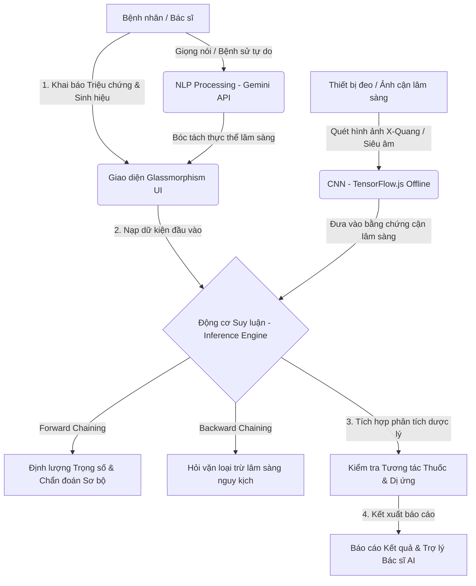

# 🩺 Hệ Thống Chẩn Đoán Y Khoa AI (Advanced Medical Diagnosis System)

<p align="center">
  
</p>

<p align="center">
  
  
  
  
  
</p>

---

## 🚀 Giới Thiệu Dự Án

**Hệ Thống Chẩn Đoán Y Khoa AI** là giải pháp phần mềm hỗ trợ chẩn đoán lâm sàng và phân tích cận lâm sàng thông minh, được nghiên cứu và phát triển bởi **nhóm DaTai**. 

Ứng dụng kết hợp giữa **Hệ chuyên gia cổ điển (Classic Expert System)** dựa trên luật lập luận y học chặt chẽ và **Trí tuệ nhân tạo hiện đại (Deep Learning & LLM)**. Hệ thống mang lại trải nghiệm tương tác trực quan cao cấp bằng giao diện **Glassmorphism**, hỗ trợ đắc lực cho nhân viên y tế trong quá trình khai thác bệnh sử, quản lý hồ sơ và ra quyết định lâm sàng một cách chính xác, an toàn.

---

## 🛠️ Kiến Trúc Hệ Thống (System Architecture)

Hệ thống được phát triển theo mô hình phân tách vai trò rõ rệt (**Separation of Concerns**), tối ưu hóa tính toán ngay tại thiết bị của người dùng (Edge Inferencing) nhằm đảm bảo tốc độ và bảo mật dữ liệu y tế:



---

## 🌟 Các Phân Hệ Tính Năng Cốt Lõi

### 1. 🧬 Động Cơ Suy Luận Lâm Sàng Kép (Hybrid Inference Engine)
*   **Lập luận Tiến (Forward Chaining)**: Tự động đối chiếu hệ thống triệu chứng đa cơ quan với bộ hơn 100+ luật bệnh học, kết hợp với các **Yếu tố sửa đổi (Modifiers)** như độ tuổi, giới tính và bệnh lý nền để tính toán **Độ tự tin chẩn đoán (Certainty Factor)**.
*   **Lập luận Lùi (Backward Chaining)**: Khi phát hiện nguy cơ mắc các bệnh lý khẩn cấp (như nhồi máu cơ tim, đột quỵ, viêm phổi phế nang), động cơ sẽ tự động truy vấn ngược các triệu chứng còn thiếu của luật đó để hiển thị giao diện "Hỏi vặn", giúp bác sĩ không bỏ sót bất kỳ dấu hiệu sinh mạng nào.

### 2. 📸 Phân Hệ Cận Lâm Sàng & Trí Tuệ Nhân Tạo Rìa (Edge AI Computer Vision)
*   **Chẩn Đoán Hình Ảnh Ngoại Tuyến (CNN)**: Tải và chạy trực tiếp mô hình phân loại hình ảnh học sâu thông qua thư viện **TensorFlow.js** và **MobileNet**. Hỗ trợ quét và phát hiện rủi ro bất thường từ:
    *   *Phim X-Quang phổi* (Đông đặc, bóng mờ).
    *   *Ảnh da liễu* (Sang thương da).
    *   *Ảnh siêu âm* (Khối u y khoa).
*   **Trích xuất Dữ liệu Xét nghiệm (Lab Test OCR)**: Bộ giả lập số hóa tự động chuyển hóa các bảng số liệu xét nghiệm hóa sinh phức tạp thành dữ liệu cấu trúc, đánh dấu các chỉ số vượt ngưỡng an toàn và đưa ra tư vấn tự động.

### 3. 🤖 Trợ Lý Bác Sĩ AI & Phân Tích Ngôn Ngữ Tự Nhiên (Gemini NLP)
*   **Thu âm & Bóc tách Bệnh sử**: Hỗ trợ ghi âm lời kể bệnh nhân qua **Web Speech API**, sau đó sử dụng **Gemini 2.0 Flash API** để bóc tách ngôn ngữ tự nhiên thành danh sách các mã triệu chứng chuẩn y khoa để tự động tích chọn trên hệ thống.
*   **Chatbot Tư vấn Chuyên sâu**: Trò chuyện trực tiếp với Bác sĩ AI theo ngữ cảnh của ca bệnh hiện tại, hỗ trợ tư vấn phác đồ và giải đáp các câu hỏi y khoa chuyên sâu của người bệnh.

### 4. 🗂️ Phân Hệ Quản Lý Bệnh Án Điện Tử (EMR Client-side)
*   **Dược lý Lâm sàng**: Tự động đối chiếu đơn thuốc bệnh nhân đang dùng với bệnh lý chẩn đoán để đưa ra cảnh báo chống chỉ định nguy hiểm (như dùng Aspirin khi loét dạ dày hoặc tương tác giữa Corticoid và NSAID).
*   **Wearables Sync**: Giả lập API kết nối đồng hồ thông minh để đồng bộ nhanh 4 chỉ số sinh hiệu sinh mạng (Huyết áp, Đường huyết, Nhịp tim, SpO2).
*   **Quản trị Dữ liệu**: Lưu trữ an toàn cục bộ, hỗ trợ tìm kiếm theo Mã Bệnh Nhân (PID) và **kết xuất báo cáo lâm sàng định dạng CSV**.

---

## 🛠️ Công Nghệ Phát Triển (Tech Stack)

*   **Giao diện**: HTML5 Semantic, CSS3 Glassmorphism (Gradients, Back-drop filter, CSS Grid/Flexbox).
*   **Hệ thống Logic**: Modern JavaScript (ES6+, OOP, Async/Await, Modular Design).
*   **Mạng Nơ-ron & Mô hình học sâu**: `@tensorflow/tfjs` & `@tensorflow-models/mobilenet`.
*   **Trí tuệ nhân tạo tạo sinh**: Google Gemini API Integration (`gemini-2.0-flash`).
*   **Hỗ trợ dịch thuật**: Google Translate Integration.

---

## 🚀 Hướng Dẫn Cài Đặt & Chạy Cục Bộ (Local Deployment)

Vì dự án được thiết kế tối ưu chạy hoàn toàn ở Client-side, bạn không cần thiết lập cơ sở dữ liệu hay môi trường phức tạp:

### Bước 1: Tải mã nguồn
```bash
git clone https://github.com/DaTaiGroup/DuAnYKhoa.git
cd DuAnYKhoa
```

### Bước 2: Chạy máy chủ cục bộ (Local Server)
Để các tính năng như TensorFlow.js và Web Speech API hoạt động ổn định nhất, khuyến khích chạy qua một máy chủ HTTP cục bộ thay vì mở trực tiếp file:

*   **Cách 1: Sử dụng VS Code Extension (Khuyên dùng)**
    *   Cài đặt extension **Live Server** trong VS Code.
    *   Click chuột phải vào file `index.html` và chọn **Open with Live Server**.

*   **Cách 2: Sử dụng Python (Nếu máy đã cài Python)**
    ```bash
    # Python 3.x
    python -m http.server 8080
    ```
    Sau đó truy cập địa chỉ `http://localhost:8080` trên trình duyệt.

*   **Cách 3: Sử dụng Node.js**
    ```bash
    npm install -g http-server
    http-server -p 8080
    ```

### Bước 3: Cấu hình Khóa API Gemini
1. Truy cập [Google AI Studio](https://aistudio.google.com/) để nhận API Key miễn phí.
2. Tại giao diện ứng dụng, nhấp vào biểu tượng **⚙️ Cài đặt** ở góc trên cùng của Menu bên trái.
3. Dán khóa API của bạn và chọn Lưu.

---

## 👥 Thành Viên Phát Triển (Nhóm DaTai)

Dự án được hoàn thiện nhờ sự đóng góp nhiệt huyết của các thành viên nhóm **DaTai**:

| STT | Họ và Tên | Vai trò chính | GitHub |
| :---: | :--- | :--- | :--- |
| 1 | **Nguyễn Văn A** | Trưởng nhóm / Lập trình Engine Suy luận | [@github_username](https://github.com/) |
| 2 | **Trần Thị B** | Lập trình Front-end & Glassmorphic UI | [@github_username](https://github.com/) |
| 3 | **Lê Văn C** | Tích hợp AI (TensorFlow.js & Gemini API) | [@github_username](https://github.com/) |
| 4 | **Phạm Văn D** | Kiểm thử & Thiết kế Bộ dữ liệu Y học | [@github_username](https://github.com/) |

---

## 🔒 Tuyên Bố Miễn Trừ Trách Nhiệm Y Khoa (Medical Disclaimer)

> [!WARNING]  
> **Hệ thống này được phát triển cho mục đích giáo dục, nghiên cứu khoa học công nghệ và hỗ trợ định hướng y khoa sơ bộ.** 
> Mọi thông tin chẩn đoán, phác đồ điều trị, phác đồ cấp cứu và phân tích tương tác thuốc được đưa ra bởi AI/Hệ chuyên gia chỉ mang tính chất tham khảo. Phần mềm **tuyệt đối không thay thế** cho ý kiến chuyên môn lâm sàng, chẩn đoán hình ảnh thực tế hay chỉ định điều trị trực tiếp của Bác sĩ có chứng chỉ hành nghề y khoa. Người dùng không được tự ý sử dụng hay thay đổi liều lượng thuốc dựa trên các đề xuất của hệ thống này.

---

<p align="center">
  Kiến tạo giải pháp công nghệ nâng tầm Y tế Việt Nam! 🌟<br>
  Nhóm DaTai - © 2026. All Rights Reserved.
</p>
