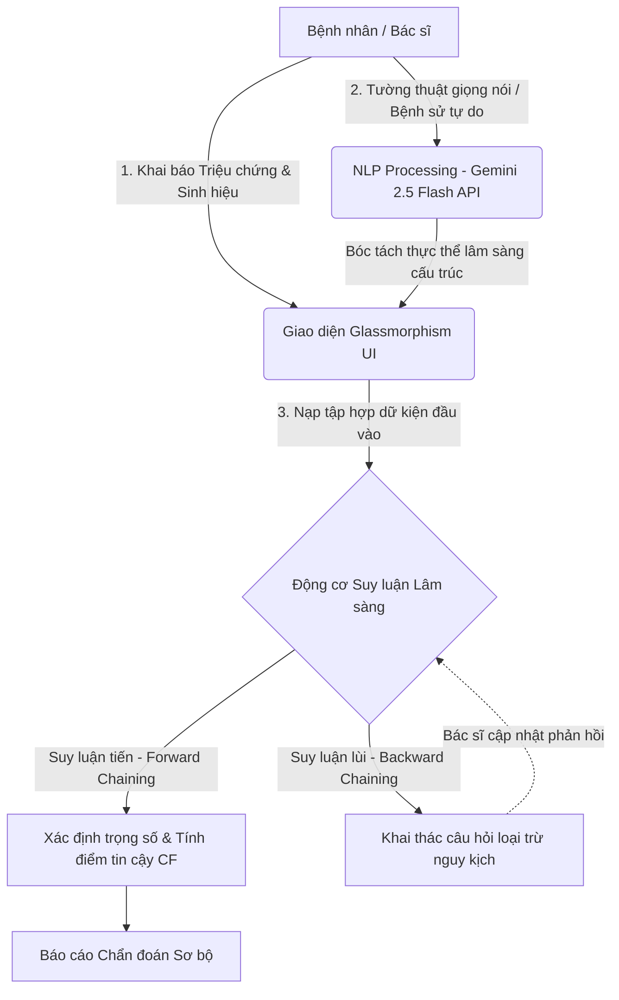

# 🩺 Hệ thống chẩn đoán y tế lai tiên tiến
### *Advanced Hybrid Medical Diagnosis System*


<p align="center">
  <a href="https://github.com/trungtin010305/YKhoa">
    
  </a>
  
  
  
</p>

---

## 🚀 Giới Thiệu Dự Án

> 💡 **Tổng quan:** **Hệ thống chẩn đoán y tế lai tiên tiến** là giải pháp phần mềm y tế kỹ thuật số đột phá được nghiên cứu và phát triển bởi **nhóm DaTai**. Hệ thống hỗ trợ tối ưu hóa quy trình khai thác bệnh sử, số hóa dữ liệu xét nghiệm lâm sàng và định hướng chẩn đoán với độ chính xác cao.

Hệ thống vận hành dựa trên cơ chế học máy lai (**Hybrid AI Model**):
*   **Hệ chuyên gia cổ điển (Classic Expert System):** Khai thác cơ sở tri thức bằng các thuật toán suy luận toán học chặt chẽ (`Forward/Backward Chaining`), đảm bảo tính minh bạch và có khả năng giải trình logic y khoa.
*   **Trí tuệ nhân tạo tạo sinh (Generative AI):** Tích hợp xử lý ngôn ngữ tự nhiên (NLP) để bóc tách thực thể lâm sàng từ các đoạn hội thoại tự do của bệnh nhân.

---

## 📱 Bản Mô Phỏng Giao Diện Thực Tế (Application Interface Mockup)

Dưới đây là cấu trúc trực quan của bảng điều khiển thông minh ứng dụng ngôn ngữ thiết kế **Glassmorphic UI**:

```text
+---------------------------------------------------------------------------------+
|  🩺 MEDICAL AI DIAGNOSIS CORE                                   [ VI | EN ]     |
+---------------------------------------------------------------------------------+
|  [ 👤 Hồ sơ Bệnh nhân ]  Họ tên: Nguyễn Văn A       Tuổi: 28     Giới tính: Nam |
+---------------------------------------------------------------------------------+
|  [ 🌡️ Chỉ số Sinh hiệu đầu vào ]                                                 |
|  - Thân nhiệt: 38.8 °C [🚨 Sốt cao]            - Chỉ số SpO2: 94% [⚠️ Nguy cơ]   |
+---------------------------------------------------------------------------------+
|  [ 🗣️ Tường thuật Bệnh sử tự do (NLP Input via Gemini API) ]                     |
|  "Tôi bị ho khan liên tục khoảng 3 ngày nay, tối đến cảm thấy hơi khó thở và     |
|   mất hoàn toàn vị giác khi ăn uống..."                                         |
+---------------------------------------------------------------------------------+
|  [ 🧠 KẾT QUẢ CHẨN ĐOÁN LÂM SÀNG SƠ BỘ ]                                        |
|  ■ Định hướng 1: Nhiễm trùng đường hô hấp cấp (Độ tin cậy CF: 87.5%)            |
|  ■ Khuyến nghị: Thực hiện chụp X-Quang phổi thẳng và test nhanh vi-rút.          |
+---------------------------------------------------------------------------------+
```

---

## 🛠️ Kiến Trúc Hệ thống

Để đảm bảo tính toàn vẹn và bảo mật dữ liệu y tế nhạy cảm, hệ thống áp dụng nguyên lý **Separation of Concerns (SoC)** và thực thi toán học cục bộ (**Edge Inference**) trực tiếp ở phía Client.



---

## ✨ Tính Năng Cốt Lõi

### 🧠 Động Cơ Suy Luận Lai (Inference Engine)

*   **Suy luận tiến (Forward Chaining):** Quét toàn bộ kho dữ liệu tri thức dựa trên các triệu chứng hiện tại để khoanh vùng bệnh lý phù hợp.
*   **Suy luận lùi (Backward Chaining):** Tự động đặt câu hỏi lâm sàng thông minh để xác minh hoặc loại trừ chẩn đoán khi phát hiện nguy cơ diễn tiến nặng.
*   **Điểm số tin cậy (Certainty Factor):** Áp dụng công thức định lượng khả năng mắc bệnh lý kết hợp:
    $$CF_{\text{combined}} = CF_1 + CF_2 \times (1 - CF_1)$$

### 🗣️ Trợ Lý Ngôn Ngữ Tự Nhiên Y Khoa

*   Tự động biên dịch dữ liệu thô, lời kể không cấu trúc thành cấu trúc `Key-Value` phù hợp với hệ thống thông qua kết nối `Gemini 2.5 Flash API`.

### ⚡ Vận Hành Edge AI Siêu Tốc

*   Tốc độ phản hồi tức thì, gần như bằng 0ms độ trễ mạng nhờ cơ chế thực thi logic và xử lý mô hình cục bộ ngay trên trình duyệt với `TensorFlow.js`, giúp ứng dụng chạy mượt mà ngay cả khi thiết bị ngoại tuyến.

---

## 📊 Phân Nhóm Ngưỡng Chỉ Số Tri Thức (Knowledge Thresholds)

Hệ thống chuyển đổi các chỉ số lâm sàng thu thập được thành các vector logic dựa trên bảng phân loại y khoa tích hợp sẵn:

| Chỉ số sinh hiệu | Ngưỡng bình thường | Ngưỡng nguy cơ (Cảnh báo số hóa) | hệ thống Trạng Trạng thái |
| :--- | :--- | :--- | :--- |
| **Thân nhiệt** | $36.5^\circ\text{C} - 37.5^\circ\text{C}$ | $<35^\circ\text{C}$ hoặc $>38.5^\circ\text{C}$ | 🚨 `FEVER_ALERT` |
| **Nồng độ SpO2** | $96\% - 100\%$ | $\le 94\%$ | 🚑 `HYPOXIA_CRITICAL` |
| **Huyết áp tâm thu**| $90\text{ mmHg} - 120\text{ mmHg}$ | $<90\text{ mmHg}$ hoặc $>140\text{ mmHg}$ | ⚠️ `BP_ANOMALY` | 

---

## 🧰 Hệ Sinh Thái Công Nghệ (Technology Stack Mapping)

| Lớp kiến trúc (Layer) | Công nghệ tích hợp | Mục tiêu tối ưu |
| :--- | :--- | :--- |
| **Giao diện (Front-End)** | HTML5 Semantic, CSS3 Vanilla, Glassmorphic Design | Tối đa tốc độ tải trang, tăng mật độ trải nghiệm thị giác cho Bác sĩ. |
| **Xử lý hội thoại (NLP)** | Google Gemini 2.5 Flash API | Trích xuất ngữ nghĩa thực thể y khoa thời gian thực từ chuỗi văn bản tự do. |
| **Lõi suy luận (Logic)** | Thuật toán Chaining thuần (ES6 Engine) | Thực thi cây quyết định lập luận y học không cần giao tiếp Server. |
| **Học sâu (Edge Deep Learning)** | TensorFlow.js | Sẵn sàng chạy các mô hình phân loại nén trực tiếp trên trình duyệt. |

---

## 📂 Cấu Trúc Mã Nguồn

```text
├── index.html          # Cấu trúc giao diện chính, tối ưu hóa ngữ nghĩa HTML5
├── style.css           # Ngôn ngữ thiết kế Glassmorphic UI (hiệu ứng kính mờ & responsive)
├── app.js              # Khởi tạo ứng dụng, quản lý trạng thái và phối hợp API Gemini
├── inferenceEngine.js  # Bộ lõi logic thuật toán (Forward/Backward Chaining) & tính toán CF
└── knowledgeBase.js    # Cơ sở dữ liệu tri thức y khoa (Danh mục bệnh học, triệu chứng, sinh hiệu)
```

---

## 👥 Bảng Phân Công Nhiệm Vụ Thành Viên (Team Responsibility)

Dưới đây là sơ đồ phân nhiệm chi tiết cho các thành viên thuộc **nhóm DaTai** trong suốt vòng đời phát triển dự án:

| Thành viên | Nhiệm vụ cụ thể | Minh chứng mã nguồn |
| :--- | :--- | :--- |
| **Nguyễn Trung Tín (Nhóm Trưởng)** | - Thiết kế thuật toán suy luận `Forward/Backward Chaining`. <br> - Xây dựng công thức tính trọng số điểm tin cậy ($CF$). | `inferenceEngine.js` |
| **Nguyễn Nhất Linh** | - Nghiên cứu định danh danh mục bệnh lý y khoa. <br> - Thiết lập ma trận ánh xạ giữa triệu chứng và ngưỡng sinh hiệu. | `knowledgeBase.js` |
| **Nguyễn Quốc Khánh** | - Phát triển giao diện người dùng theo phong cách **Glassmorphism**. <br> - Tối ưu hóa UI/UX responsive đa nền tảng. | `index.html`, `style.css` |
| **Phạm Nguyễn Tấn Đạt** | - Tích hợp luồng điều phối ứng dụng. <br> - Thiết kế hệ thống prompt-engineering kết nối cấu trúc `Gemini API`. | `app.js` |
| **Huỳnh Nhựt Hải** | - Lập kịch bản kiểm thử lâm sàng giả định. <br> - Kiểm tra và phát hiện lỗi luồng logic (Edge cases). | `README.md` (Testing Section) |

---

## 🛡️ Tiêu Chuẩn Bảo Mật & Quyền Riêng Tư (Data Privacy)

*   **Zero-Server Storage:** Hệ thống không lưu trữ bất kỳ thông tin cá nhân hay lịch sử triệu chứng nào của bệnh nhân lên server máy chủ trung gian.
*   **Local Processing:** Toàn bộ dữ liệu tính toán logic chuyên gia được cô lập bên trong bộ nhớ Runtime cục bộ của trình duyệt người dùng.
*   **API Security:** Khóa cấu hình kết nối API thông minh được mã hóa đầu cuối và chỉ kích hoạt khi thực hiện yêu cầu bóc tách ngôn ngữ tự nhiên.

---

## 💻 Hướng Dẫn Cài Đặt & Khởi Chạy

### 1. Phục hồi / Tải mã nguồn về máy
```bash
git clone [https://github.com/trungtin010305/YKhoa.git](https://github.com/trungtin010305/YKhoa.git)
cd YKhoa
```

### 2. Cấu hình Khóa API
Mở tệp `app.js` và cập nhật khóa bảo mật cá nhân của bạn:
```javascript
const GEMINI_API_KEY = "YOUR_SECURE_GEMINI_API_KEY_HERE";
```

### 3. Khởi chạy máy chủ nội bộ
Hệ thống vận hành hoàn toàn ở phía Client. Để các ES6 Module hoạt động chính xác, hãy chạy ứng dụng bằng một máy chủ tĩnh:
*   **Cách 1:** Sử dụng extension **Live Server** trên VS Code (Chuột phải vào `index.html` chọn *Open with Live Server*).
*   **Cách 2:** Sử dụng lệnh Python: `python -m http.server 8080` rồi truy cập qua trình duyệt tại `http://localhost:8080`.

---

## 🧪 Bản Kiểm tra Thử Lâm Sàng

| Tình huống giả định | Triệu chứng đầu vào | Kết quả hệ thống kỳ vọng |
| :--- | :--- | :--- |
| **Kịch bản 1** | Sốt cao $>39^\circ\text{C}$, ho khan, mất vị giác, SpO2 $94\%$ | Kích hoạt cảnh báo suy hô hấp / Định hướng nhiễm virus |
| **Kịch bản 2** | Đau âm ỉ vùng thượng vị, ợ chua, xuất hiện lúc đói | Gợi ý theo dõi viêm loét dạ dày - tá tràng |

---

## 🗺️ Lộ Trình Phát Triển Dự Án (Project Roadmap)

- [x] **Giai đoạn 1:** Xây dựng lõi thuật toán suy luận lai (Hybrid Engine) và giao diện Web cơ bản.
- [ ] **Giai đoạn 2:** Mở rộng Cơ sở dữ liệu tri thức (`knowledgeBase.js`) lên hơn 150+ mã định danh bệnh lý phổ biến.
- [ ] **Giai đoạn 3:** Nghiên cứu tích hợp WebRTC kết nối đo đạc trực tiếp từ các thiết bị IoT y tế cá nhân cầm tay.

---

## 🤝 Đóng góp & Giấy Phép

*   **Đóng góp:** Mọi ý kiến tối ưu hóa mã nguồn hoặc bổ sung cơ sở tri thức y khoa tại `knowledgeBase.js` vui lòng mở một **Pull Request** giải trình chi tiết.
*   **Giấy phép:** Dự án được bảo hộ và phát hành theo mã nguồn mở [MIT License](https://opensource.org/licenses/MIT).
*   ## :lock: Tuyên Bố Miễn Trừ Trách Nhiệm Y Khoa (Medical Disclaimer)

> [!WARNING]  
> **DỰ ÁN ĐƯỢC XÂY DỰNG DÙNG CHO MỤC ĐÍCH GIÁO DỤC, NGHIÊN CỨU CÔNG NGHỆ THÔNG TIN VÀ ĐỊNH HƯỚNG Y KHOA BAN ĐẦU.**
> 
> Mọi kết luận chẩn đoán sơ bộ, phác đồ cấp cứu sơ khởi hay phân tích phản ứng tương tác dược lý được đề xuất bởi Hệ chuyên gia/Trí tuệ nhân tạo chỉ mang tính chất tham khảo cứu cánh. Hệ thống **tuyệt đối không thay thế** cho các chỉ định lâm sàng trực tiếp, chẩn đoán hình ảnh cận lâm sàng thực tế và phác đồ điều trị chuyên khoa từ các Bác sĩ, chuyên gia y tế có chứng chỉ hành nghề hợp pháp. Người sử dụng không được tự ý điều chỉnh liều lượng hoặc mua thuốc sử dụng dựa trên đề xuất của ứng dụng này.
<p align="center">
  <strong>Kiến tạo giải pháp công nghệ số nâng tầm nền Y tế Việt Nam! 🚀</strong><br>
  Nhóm DaTai - © 2026. Mọi quyền được bảo lưu.
</p>
