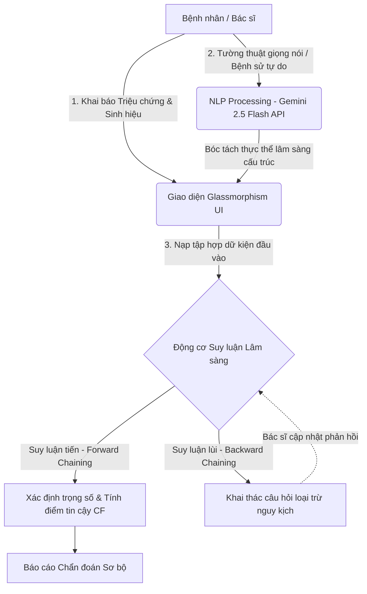

# 🩺 Hệ Thống Chẩn Đoán Y Khoa AI
### *Advanced Hybrid Medical Diagnosis System*


<p align="center">
  <a href="https://github.com/trungtin010305/YKhoa">
    
  </a>
  
  
  
</p>

---

## 🚀 Giới Thiệu Dự Án

> 💡 **Tổng quan:** **Hệ Thống Chẩn Đoán Y Khoa AI** là giải pháp phần mềm y tế kỹ thuật số đột phá được nghiên cứu và phát triển bởi **nhóm DaTai**. Hệ thống hỗ trợ tối ưu hóa quy trình khai thác bệnh sử, số hóa dữ liệu xét nghiệm lâm sàng và định hướng chẩn đoán với độ chính xác cao.

Hệ thống vận hành dựa trên cơ chế học máy lai (**Hybrid AI Model**):
*   **Hệ chuyên gia cổ điển (Classic Expert System):** Khai thác cơ sở tri thức bằng các thuật toán suy luận toán học chặt chẽ (`Forward/Backward Chaining`), đảm bảo tính minh bạch và có khả năng giải trình logic y khoa.
*   **Trí tuệ nhân tạo tạo sinh (Generative AI):** Tích hợp xử lý ngôn ngữ tự nhiên (NLP) để bóc tách thực thể lâm sàng từ các đoạn hội thoại tự do của bệnh nhân.

---

## 🛠️ Kiến Trúc Hệ Thống

Để đảm bảo tính toàn vẹn và bảo mật dữ liệu y tế nhạy cảm, hệ thống áp dụng nguyên lý **Separation of Concerns (SoC)** và thực thi toán học cục bộ (**Edge Inference**) trực tiếp ở phía Client.



---

## ✨ Tính Năng Cốt Lõi

### 🧠 Động Cơ Suy Luận Lai (Inference Engine)

*   **Suy luận tiến (Forward Chaining):** Quét toàn bộ kho dữ liệu tri thức dựa trên các triệu chứng hiện tại để khoanh vùng bệnh lý phù hợp.
*   **Suy luận lùi (Backward Chaining):** Tự động đặt câu hỏi lâm sàng thông minh để xác minh hoặc loại trừ chẩn đoán khi phát hiện nguy cơ diễn tiến nặng.
*   **Điểm số tin cậy (Certainty Factor):** Áp dụng công thức định lượng khả năng mắc bệnh:
    $$CF_{combined} = CF_1 + CF_2 \times (1 - CF_1)$$

### 🗣️ Trợ Lý Ngôn Ngữ Tự Nhiên Y Khoa

*   Tự động biên dịch dữ liệu thô, lời kể không cấu trúc thành cấu trúc `Key-Value` phù hợp với hệ thống thông qua `Gemini 2.5 Flash API`.

### ⚡ Vận Hành Edge AI Siêu Tốc

*   Tốc độ phản hồi tức thì ($\approx 0\text{ms}$ độ trễ mạng) nhờ xử lý mô hình cục bộ với `TensorFlow.js`, cho phép ứng dụng chạy mượt mà ngay cả khi ngoại tuyến.

---

## 📂 Cấu Trúc Mã Nguồn

```text
├── index.html          # Cấu trúc giao diện chính, tối ưu hóa ngữ nghĩa HTML5
├── style.css           # Ngôn ngữ thiết kế Glassmorphic UI (hiệu ứng kính mờ & responsive)
├── app.js              # Khởi tạo ứng dụng, quản lý trạng thái và phối hợp API Gemini
├── inferenceEngine.js  # Bộ lõi logic thuật toán (Forward/Backward Chaining) & tính toán CF
└── knowledgeBase.js    # Cơ sở dữ liệu tri thức y khoa (Danh mục bệnh học, triệu chứng, sinh hiệu)
```

---

## 💻 Hướng Dẫn Cài Đặt & Khởi Chạy

### 1. Sao chép kho lưu trữ
```bash
git clone [https://github.com/trungtin010305/YKhoa.git](https://github.com/trungtin010305/YKhoa.git)
cd YKhoa
```

### 2. Cấu hình Khóa API
Mở tệp `app.js` và cập nhật khóa bảo mật của bạn:
```javascript
const GEMINI_API_KEY = "YOUR_SECURE_GEMINI_API_KEY_HERE";
```

### 3. Khởi chạy máy chủ nội bộ
Hệ thống vận hành hoàn toàn ở phía Client. Để các ES6 Module hoạt động chính xác, hãy chạy ứng dụng bằng một máy chủ tĩnh:
*   **Cách 1:** Sử dụng extension **Live Server** trên VS Code (Chuột phải vào `index.html` chọn *Open with Live Server*).
*   **Cách 2:** Sử dụng lệnh Python: `python -m http.server 8080` rồi truy cập qua trình duyệt tại `http://localhost:8080`.

---

## 🧪 Kịch Bản Kiểm Thử Lâm Sàng

| Tình huống giả định | Triệu chứng đầu vào | Kết quả hệ thống kỳ vọng |
| :--- | :--- | :--- |
| **Kịch bản 1** | Sốt cao $>39^\circ\text{C}$, ho khan, mất vị giác, SpO2 $94\%$ | Kích hoạt cảnh báo suy hô hấp / Định hướng nhiễm virus |
| **Kịch bản 2** | Đau âm ỉ vùng thượng vị, ợ chua, xuất hiện lúc đói | Gợi ý theo dõi viêm loét dạ dày - tá tràng |

---

## 🤝 Đóng Góp & Giấy Phép

*   **Đóng góp:** Mọi ý kiến tối ưu hóa mã nguồn hoặc bổ sung cơ sở tri thức y khoa tại `knowledgeBase.js` vui lòng mở một **Pull Request** giải trình chi tiết.
*   **Giấy phép:** Dự án được bảo hộ và phát hành theo mã nguồn mở [MIT License](https://github.com/trungtin010305/YKhoa/blob/main/LICENSE).
## 🔒 Tuyên Bố Miễn Trừ Trách Nhiệm Y Khoa (Medical Disclaimer)

> [!WARNING]  
> **DỰ ÁN ĐƯỢC XÂY DỰNG DÙNG CHO MỤC ĐÍCH GIÁO DỤC, NGHIÊN CỨU CÔNG NGHỆ THÔNG TIN VÀ ĐỊNH HƯỚNG Y KHOA BAN ĐẦU.**
> 
> Mọi kết luận chẩn đoán sơ bộ, phác đồ cấp cứu sơ khởi hay phân tích phản ứng tương tác dược lý được đề xuất bởi Hệ chuyên gia/Trí tuệ nhân tạo chỉ mang tính chất tham khảo cứu cánh. Hệ thống **tuyệt đối không thay thế** cho các chỉ định lâm sàng trực tiếp, chẩn đoán hình ảnh cận lâm sàng thực tế và phác đồ điều trị chuyên khoa từ các Bác sĩ, chuyên gia y tế có chứng chỉ hành nghề hợp pháp. Người sử dụng không được tự ý điều chỉnh liều lượng hoặc mua thuốc sử dụng dựa trên đề xuất của ứng dụng này.

## 👥 Ban Nghiên Cứu & Phát Triển (Đội Ngũ DaTai)

Dự án được duy trì và nâng cấp bởi các thành viên thuộc nhóm **DaTai**:

| Ảnh Đại Diện | Họ và Tên | Vai Trò Chuyên Môn | Kênh Kết Nối |
| :---: | :--- | :--- | :--- |
|  | **Nguyễn Trung Tín** | Trưởng nhóm nghiên cứu / Kiến trúc sư Động cơ Lập luận | [](https://github.com/) |
|  | **Nguyễn Nhất linh** | Trưởng nhóm UI/UX / Lập trình hệ thống Glassmorphism | [](https://github.com/) |
|  | **Nguyễn Quốc Khánh** | Kỹ sư Trí tuệ Nhân tạo / Tích hợp TensorFlow & Gemini | [](https://github.com/) |
|  | **Phạm Nguyễn Tấn Đạt** | Kỹ sư Dữ liệu / Trưởng nhóm Số hóa Quy tắc Y học | [](https://github.com/) |
