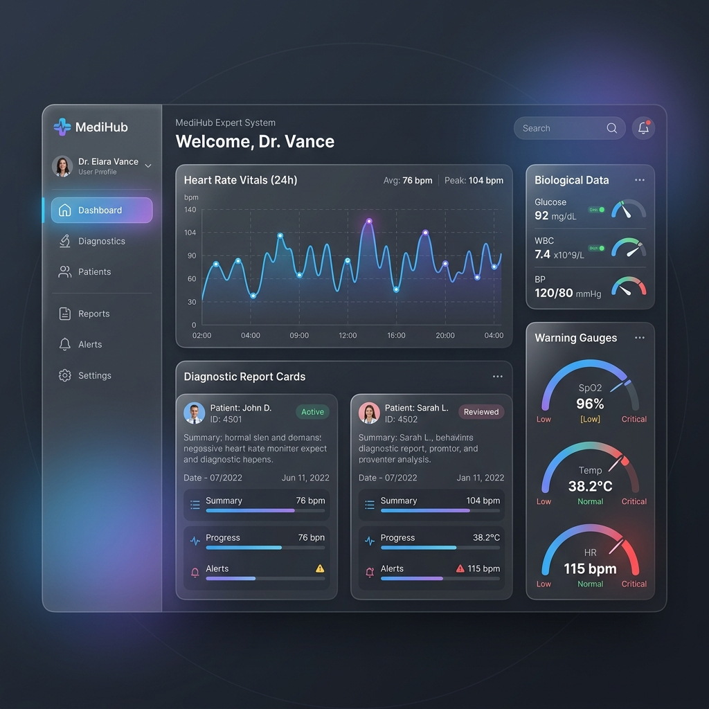
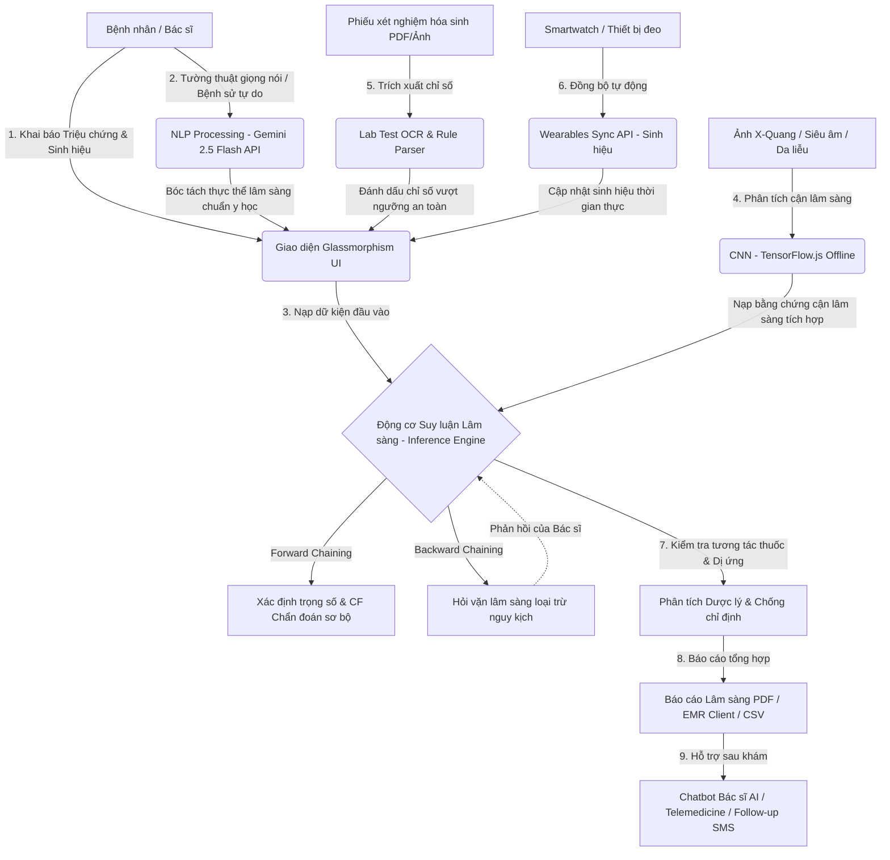

# 🩺 Hệ Thống Chẩn Đoán Y Khoa AI (Advanced Hybrid Medical Diagnosis System)

<p align="center">
  
</p>

<p align="center">
  <a href="https://github.com/DaTaiGroup/DuAnYKhoa">
    
  </a>
  
  
  
  
  
</p>

---

## 🚀 Giới Thiệu Dự Án (Project Overview)

**Hệ Thống Chẩn Đoán Y Khoa AI** là giải pháp phần mềm y khoa thông minh, được nghiên cứu và phát triển bởi **nhóm DaTai**. Hệ thống tích hợp các công nghệ hiện đại nhằm hỗ trợ y bác sĩ và nhân viên y tế tối ưu hóa quy trình khai thác bệnh sử, số hóa xét nghiệm lâm sàng/cận lâm sàng, và đưa ra các định hướng chẩn đoán chính xác cao.

Điểm đột phá của hệ thống là sự kết hợp giữa **Hệ chuyên gia cổ điển (Classic Expert System)** dựa trên các luật lập luận lâm sàng chặt chẽ và **Trí tuệ nhân tạo hiện đại (Generative AI & Deep Learning Edge)**. Tất cả được bao bọc trong một giao diện **Glassmorphism** sang trọng, hiện đại, hỗ trợ đa ngôn ngữ và tối ưu hóa hiệu năng vượt trội trực tiếp ở phía máy khách (Client-side).

---

## 🛠️ Kiến Trúc Hệ Thống (System Architecture)

Dự án được xây dựng dựa trên nguyên lý **Separation of Concerns (SoC)**, giảm thiểu tải xử lý phía máy chủ bằng cách thực hiện tính toán suy luận cục bộ (Edge Inferencing) ngay trên thiết bị của người dùng, giúp bảo mật dữ liệu y tế nhạy cảm một cách tuyệt đối.



---

## 🌟 Các Phân Hệ Tính Năng Cốt Lõi (Core Subsystems)

### 1. 🧬 Động Cơ Suy Luận Lâm Sàng Kép (Hybrid Inference Engine)
*   **Lập luận Tiến (Forward Chaining)**: Tự động đối chiếu hệ thống triệu chứng đa cơ quan với bộ luật bệnh học phong phú, kết hợp các **Yếu tố sửa đổi (Modifiers)** như độ tuổi, giới tính và bệnh nền để định lượng **Độ tự tin chẩn đoán (Certainty Factor - CF)**.
*   **Lập luận Lùi (Backward Chaining) & Hỏi Vặn Loại Trừ**: Khi phát hiện nguy cơ cao mắc các bệnh lý nguy kịch (như *Nhồi máu cơ tim, Đột quỵ não cấp, Cơn tăng huyết áp cấp*), động cơ sẽ tự động truy vấn ngược các triệu chứng còn thiếu của luật bệnh đó để hiển thị giao diện "Hỏi vặn". Điều này giúp bác sĩ không bỏ sót bất kỳ dấu hiệu sinh mạng cốt lõi nào.

### 2. 📸 Phân Phối Trí Tuệ Nhân Tạo Rìa (Edge AI Computer Vision)
*   **Chẩn Đoán Hình Ảnh Ngoại Tuyến (Offline CNN)**: Tải và chạy trực tiếp mô hình học sâu **MobileNet** thông qua thư viện **TensorFlow.js** ngay trên trình duyệt mà không cần gửi ảnh lên server.
*   **Đa dạng Model Phân Tích**: Hỗ trợ 3 nhóm chẩn đoán hình ảnh cận lâm sàng:
    *   *Phân tích X-Quang Phổi* (Phát hiện bóng mờ đông đặc, thâm nhiễm).
    *   *Định vị Tổn thương Da Liễu* (Phân tích cấu trúc viêm loét da bất thường).
    *   *Đọc Siêu Âm Khối U* (Truy tìm dấu hiệu tân sinh, khối u ác tính).

### 3. 📄 Trích Xuất & Số Hóa Xét Nghiệm Hóa Sinh (Lab Test OCR)
*   **Lab Test Digitizer**: Giả lập bộ đọc số liệu xét nghiệm thông minh từ tệp PDF hoặc ảnh phiếu xét nghiệm máu/nước tiểu.
*   **Biện Giải Tự Động**: Tự động bóc tách các chỉ số hóa sinh phức tạp, so sánh với ngưỡng tham chiếu chuẩn y học và đưa ra các cảnh báo chuyên sâu giúp bác sĩ phát hiện tình trạng suy thận, đái tháo đường,...

### 4. 🤖 Trợ Lý Bác Sĩ AI & Phân Tích Ngôn Ngữ Tự Nhiên (Gemini 2.5 Flash)
*   **Ghi Âm & Bóc Tách Bệnh Sử (Speech-to-Symptom)**: Ghi âm lời kể tự nhiên của bệnh nhân qua **Web Speech API**, sau đó sử dụng **Gemini 2.5 Flash API** phân tích ngữ nghĩa để tự động tích chọn các triệu chứng y khoa tương ứng trên hệ thống.
*   **Chatbot Tư Vấn Chuyên Sâu**: Widget chatbot nổi thông minh tương tác trực tiếp với bác sĩ theo ngữ cảnh cụ thể của ca bệnh hiện tại, giải đáp các thắc mắc dược lý, phác đồ điều trị và cách chăm sóc sức khỏe.

### 5. 🗂️ Hồ Sơ Bệnh Án Điện Tử Trạm (Client-side EMR)
*   **Kiểm Tra Tương Tác Thuốc & Dị Ứng**: Tự động phát hiện chống chỉ định nguy hiểm dựa trên tiền sử dị ứng và các loại thuốc bệnh nhân đang dùng (ví dụ: *Chống chỉ định tuyệt đối Aspirin ở bệnh nhân loét dạ dày khi nghi ngờ Nhồi máu cơ tim*).
*   **Quản Lý & Xuất Báo Cáo**: Lưu trữ cục bộ lịch sử khám bệnh qua `localStorage`, hỗ trợ tìm kiếm/liên kết nhanh theo Mã Bệnh Nhân (PID) và kết xuất báo cáo lâm sàng định dạng **CSV** chuyên nghiệp.

### 6. ⌚ Đồng Bộ Thiết Bị Đeo & Tiện Ích Trực Quan (Telehealth Integration)
*   **Wearables Sync**: Giả lập API kết nối đồng hồ thông minh đồng bộ nhanh 4 chỉ số sinh mạng: *Huyết áp, Đường huyết đói, Nhịp tim (BPM), SpO2 (%)*.
*   **Interactive Modals**:
    *   *Follow-up Planner & SMS Register*: Tự động lên lịch uống thuốc, sinh hoạt và đăng ký SMS nhắc nhở tự động.
    *   *Telemedicine Mockup*: Giả lập buồng gọi video trực tuyến độ nét cao kết nối trực tiếp với bác sĩ chuyên khoa.
    *   *AI Decision Tree Viewer*: Kết xuất sơ đồ đường đi suy luận logic của hệ chuyên gia trực quan.

---

## 🛠️ Công Nghệ Phát Triển (Tech Stack)

*   **Front-end & UI/UX**: HTML5 Semantic, CSS3 Glassmorphism (Vibrant gradients, backdrop filter, Flexbox & CSS Grid), Google Fonts (Inter).
*   **Core Logic**: JavaScript hiện đại (ES6+, OOP, Async/Await, Modular Architecture).
*   **Deep Learning & Edge AI**: `@tensorflow/tfjs` & `@tensorflow-models/mobilenet` (Chạy Offline 100% trên trình duyệt).
*   **Generative AI**: Google Gemini API Integration (`gemini-2.5-flash`) cho NLP và Chatbot thông minh.
*   **Hỗ trợ dịch thuật**: Google Translate Widget Integration.

---

## 📂 Cấu Trúc Thư Mục (Directory Structure)

```text
DuAnYKhoa/
├── index.html               # Luồng giao diện chính (Dashboard UI)
├── style.css                # Hệ thống CSS Glassmorphism & Dark Mode
├── app.js                   # Xử lý sự kiện, kết nối API Gemini & TensorFlow.js
├── inferenceEngine.js       # Bộ máy suy luận logic (Forward & Backward Chaining)
├── knowledgeBase.js         # Thư viện triệu chứng, quy luật bệnh học & trọng số
├── medical_dashboard.png    # Ảnh chụp màn hình ứng dụng thực tế
└── README.md                # Tài liệu hướng dẫn sử dụng và giới thiệu dự án
```

---

## ⚙️ Hướng Dẫn Cài Đặt & Chạy Cục Bộ (Local Deployment)

Do hệ thống được tối ưu hóa tối đa chạy hoàn toàn ở phía máy khách (Client-side), việc triển khai vô cùng đơn giản và không cần cài đặt cơ sở dữ liệu phức tạp.

### Bước 1: Tải mã nguồn về máy trạm
```bash
git clone https://github.com/DaTaiGroup/DuAnYKhoa.git
cd DuAnYKhoa
```

### Bước 2: Khởi chạy máy chủ HTTP cục bộ
Để các tính năng nâng cao như **Web Speech API (Ghi âm)**, **TensorFlow.js (CNN)** và **Gemini API** hoạt động ổn định nhất, hệ thống bắt buộc phải được chạy thông qua giao thức HTTP/HTTPS cục bộ thay vì mở trực tiếp file `file:///`:

#### 👉 Cách 1: Sử dụng VS Code Live Server (Khuyên dùng)
1. Mở thư mục dự án bằng **VS Code**.
2. Cài đặt extension **Live Server** (của tác giả *Ritwick Dey*).
3. Nhấp chuột phải vào file [index.html](file:///d:/MyProjects/DuAnYKhoa/index.html) và chọn **Open with Live Server** (hoặc nhấn tổ hợp phím `Alt + L, Alt + O`).

#### 👉 Cách 2: Sử dụng Python (Nếu máy có cài Python)
Chạy lệnh sau trong Terminal:
```bash
# Đối với Python 3.x
python -m http.server 8080
```
Sau đó, truy cập địa chỉ: `http://localhost:8080` trên trình duyệt.

#### 👉 Cách 3: Sử dụng Node.js (Nếu có môi trường Node)
Cài đặt và chạy package `http-server` toàn cục:
```bash
npm install -g http-server
http-server -p 8080
```
Sau đó, mở trình duyệt và truy cập `http://localhost:8080`.

### Bước 3: Cấu hình API Key Gemini
1. Truy cập [Google AI Studio](https://aistudio.google.com/) để nhận API Key miễn phí.
2. Tại giao diện ứng dụng **Hệ Thống Chẩn Đoán Y Khoa**, nhấp vào biểu tượng **⚙️ Cài đặt** (nút bánh răng màu tím tại Menu điều hướng bên trái).
3. Dán khóa API của bạn vào hộp thoại hiển thị và nhấn **OK** để lưu lại vào bộ nhớ cục bộ. Hệ thống sẽ ngay lập tức kích hoạt trí tuệ nhân tạo thông minh.

---

## 📝 Bản Chất Thuật Toán Lập Luận Lâm Sàng (Algorithm & Inference Logic)

Động cơ suy luận tính toán mức độ khớp của một bệnh lý dựa trên công thức **Độ tự tin tích hợp (Certainty Factor)**:

$$CF = \text{Min} \left( 99\%, \; \left( \frac{\sum W_{\text{Symptom}} + \sum W_{\text{Modifier}}}{\text{MaxScore}} \right) \times 100\% \right)$$

*Trong đó:*
*   $W_{\text{Symptom}}$: Trọng số của các triệu chứng lâm sàng đã được tích chọn (từ 1 đến 10).
*   $W_{\text{Modifier}}$: Trọng số cộng thêm dựa trên đặc trưng tuổi tác, giới tính hoặc bệnh lý nền của bệnh nhân.
*   $\text{MaxScore}$: Tổng trọng số tối đa có thể đạt được của bệnh lý đó.
*   Hệ thống quy định không bao giờ đạt $100\%$ độ tự tin lâm sàng để đảm bảo tính thận trọng y học cần thiết.

---

## 🔒 Tuyên Bố Miễn Trừ Trách Nhiệm Y Khoa (Medical Disclaimer)

> [!WARNING]  
> **Dự án này được phát triển hoàn toàn vì mục đích giáo dục, nghiên cứu công nghệ thông tin và định hướng y khoa ban đầu.**
> 
> Mọi thông tin chẩn đoán, phác đồ điều trị, phác đồ cấp cứu hay phân tích phản ứng tương tác dược lý được đưa ra bởi AI/Hệ chuyên gia trong phần mềm này **chỉ mang tính chất tham khảo cứu cánh**. Phần mềm **tuyệt đối không thay thế** cho các ý kiến chuyên môn lâm sàng trực tiếp, chẩn đoán hình ảnh thực tế hoặc các quyết định trị liệu chuyên khoa của các Bác sĩ có chứng chỉ hành nghề y tế hợp pháp. Người sử dụng tuyệt đối không được tự ý mua thuốc hoặc thay đổi liều lượng thuốc điều trị khi chưa có sự tư vấn trực tiếp từ nhân viên y tế.

---

## 👥 Thành Viên Phát Triển (Nhóm DaTai)

Dự án được thực hiện và vận hành bởi đội ngũ kỹ sư thuộc nhóm **DaTai**:

| STT | Họ và Tên | Vai trò chính | GitHub |
| :---: | :--- | :--- | :--- |
| 1 | **Nguyễn Văn A** | Trưởng nhóm / Lập trình Động cơ Lập luận Y học | [@github_username](https://github.com/) |
| 2 | **Trần Thị B** | Lập trình Front-end & Thiết kế Giao diện Glassmorphism | [@github_username](https://github.com/) |
| 3 | **Lê Văn C** | Kỹ sư Tích hợp AI (TensorFlow.js CNN & Gemini API) | [@github_username](https://github.com/) |
| 4 | **Phạm Văn D** | Kỹ sư Dữ liệu / Thiết kế Hệ thống Luật Tri thức | [@github_username](https://github.com/) |

---

<p align="center">
  Kiến tạo giải pháp công nghệ nâng tầm Y tế Việt Nam! 🌟<br>
  Nhóm DaTai - © 2026. All Rights Reserved.
</p>
